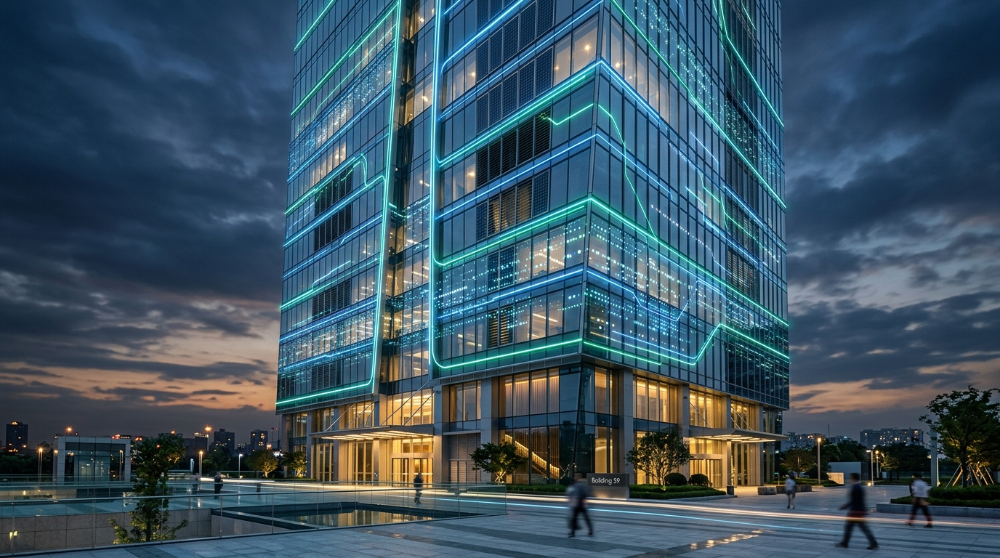
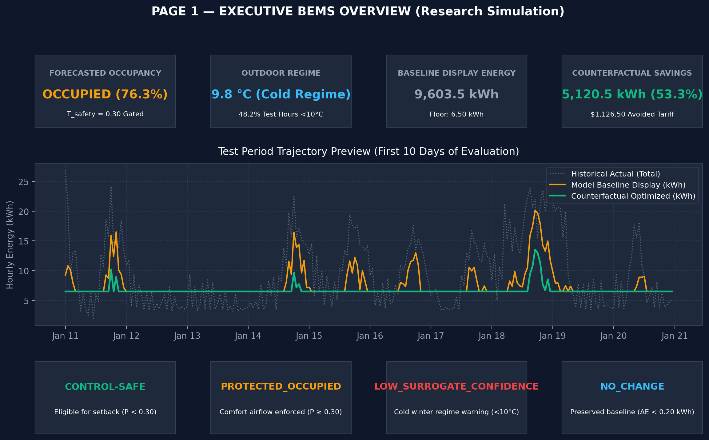
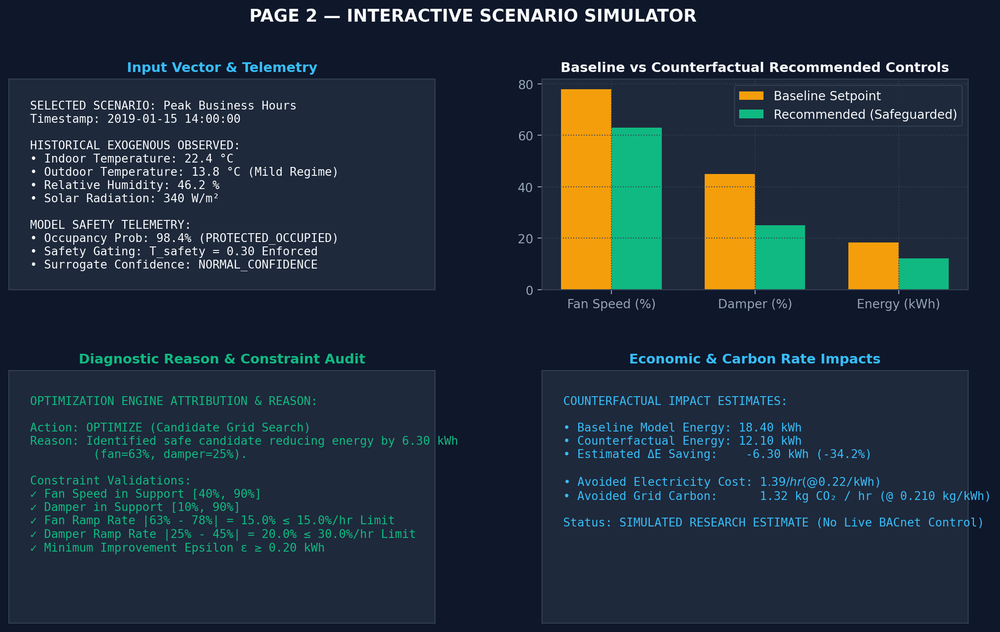
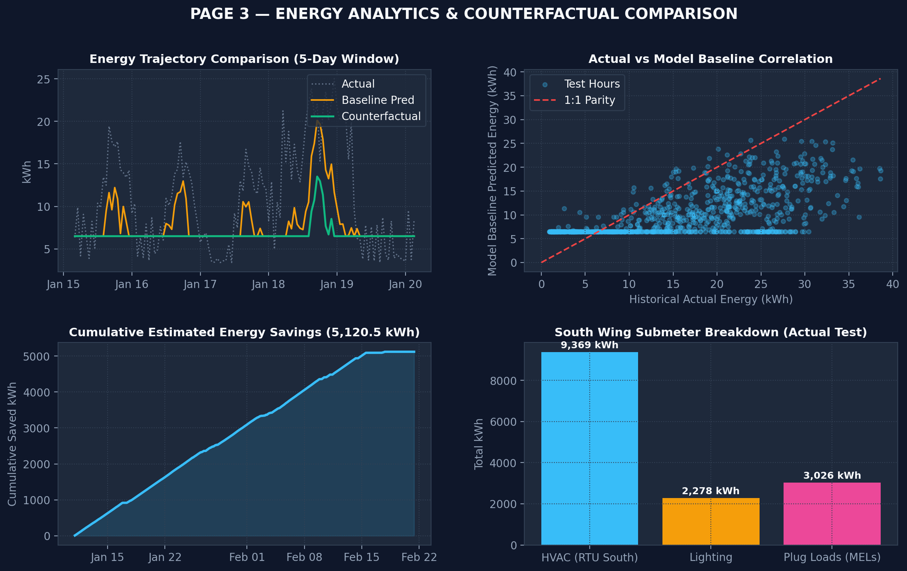
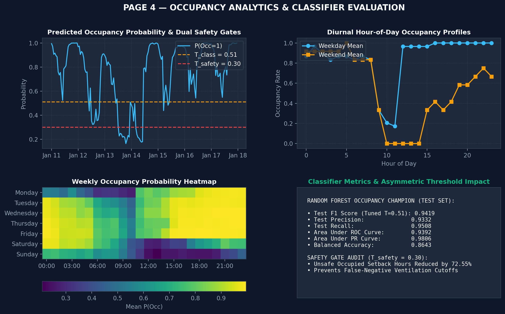
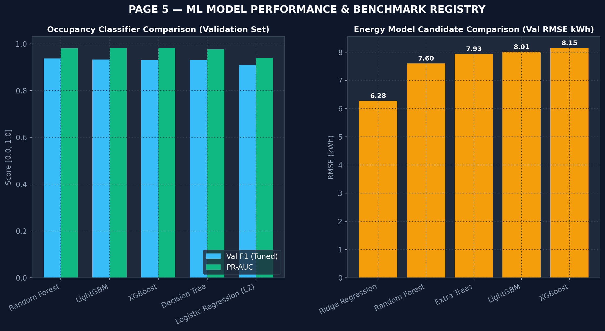
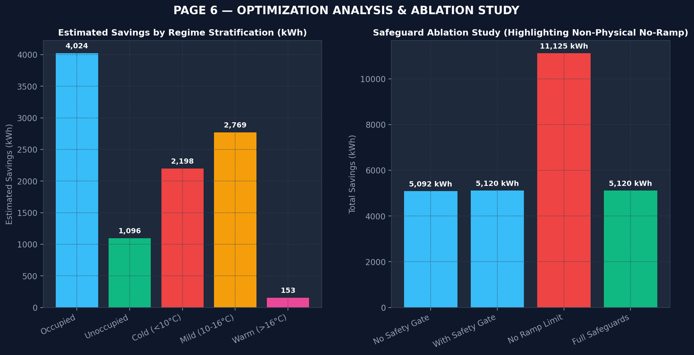

<p align="center">
  
</p>
<!-- 💡 Pro-tip: If you don't have a banner yet, you can create a sleek 1280x400 header using canva.com -->

<h1 align="center">🏢 AI-Based Energy Optimization for Smart Buildings</h1>

<p align="center">
  <strong>An End-to-End Machine Learning & Counterfactual Optimization Platform for Commercial BEMS</strong><br>
  <em>Calibrated on Lawrence Berkeley National Laboratory (LBNL) Building 59</em>
</p>

<p align="center">
  <a href="https://github.com/El3troX/ai-based-energy-optimization-for-smart-building/actions"></a>
  <a href="https://www.python.org/downloads/"></a>
  <a href="https://streamlit.io/"></a>
  <a href="https://scikit-learn.org/"></a>
  <a href="LICENSE"></a>
</p>

<p align="center">
  <a href="[LIVE_DEMO_URL]"><strong>🔗 Explore the Interactive Live Streamlit Demo »</strong></a>
</p>

<p align="center">
  <a href="#-description">Description</a> •
  <a href="#-live-demo--ui-walkthrough">Demo & UI</a> •
  <a href="#-technologies-used">Tech Stack</a> •
  <a href="#-special-gotchas--engineering-lessons">Gotchas & Insights</a> •
  <a href="#-technical-details--getting-started">Getting Started</a> •
  <a href="#-contributing">Contributing</a>
</p>

---

## 📖 Description

Commercial buildings consume approximately **40% of global primary energy**, with HVAC (Heating, Ventilation, and Air Conditioning) accounting for over half of this total. Most commercial facilities still operate under rigid, schedule-based automation timers that condition unoccupied zones and run supply fans at full throttle regardless of actual real-time occupancy.

**AI-Based Energy Optimization for Smart Buildings** is a production-grade research platform functioning as an intelligent Building Energy Management System (BEMS). Rather than treating energy forecasting as a passive academic exercise, this project implements a complete, closed-loop predictive optimization pipeline:

```
Current Building State at time t (Sensors, Weather, HVAC, Lags)
                         │
                         ▼
             Occupancy Forecast Model (t → t+1)
        [Random Forest Classifier | T_class=0.51, T_safety=0.30]
                         │
                         ▼
             Energy Forecast Surrogate Model (t → t+1)
              [L2-Regularized Ridge Surrogate | α=10]
                         │
                         ▼
            Counterfactual Scenario Optimization Engine
            [Vectorized Grid Search over 99 Feasible Pairs]
                         │
                         ▼
            Multi-Layered Mechanical & Comfort Safeguards
        [Ramp Limits (≤15%/h) | Bounds [40, 90%] | Epsilon Deadband]
                         │
                         ▼
          Recommended Setpoints & Avoided Rate Telemetry
      [Optimized Fan % & Damper % | Estimated kWh, $, and CO2 Avoided]
```

### 🔬 Academic Research Simulation Framing
All delta energy values and recommended setpoints are **model-based counterfactual estimates** derived from an empirical linear Ridge surrogate under bounded operating envelopes. In the frozen 994-hour test period (January–February 2019), the safeguarded policy achieved an estimated **53.32% reduction ($5,120.45\text{ kWh}$)** relative to baseline display energy, avoiding **$\$1,126.50$** in utility expenses and **$1,075.29\text{ kg CO}_2$** in grid emissions. These figures represent research simulation scenarios, **NOT** experimentally verified physical control or utility-measured real-world savings.

---

## 🎬 Live Demo & UI Walkthrough

<p align="center">
  <a href="[LIVE_DEMO_URL]">
    
  </a>
  <br>
  <em>(Click above to view the animated walkthrough GIF or open the live interactive Streamlit application)</em>
</p>

The interactive BEMS application is organized into **8 dedicated analytical views**:

### 1. Executive Overview & Scenario Simulator
<p align="center">
  
  
</p>
<p align="center">
  <em>Left: Real-time BEMS KPI telemetry and 10-day trajectory preview. Right: Interactive historical scenario optimizer with what-if setpoint overrides and diagnostic attribution.</em>
</p>

### 2. Tripartite Energy Analytics & Occupancy Telemetry
<p align="center">
  
  
</p>
<p align="center">
  <em>Left: Actual vs Baseline Display vs Counterfactual Optimized consumption across submeters. Right: Occupancy probability trajectory with dual decision ($T=0.51$) and safety ($T=0.30$) thresholds.</em>
</p>

### 3. Model Benchmark Registry & Optimization Ablation Studies
<p align="center">
  
  
</p>
<p align="center">
  <em>Left: 10-model benchmark registry across validation and test splits. Right: Safeguard ablation study visually proving the physical impossibility of unconstrained ramp rates.</em>
</p>

---

## 💻 Technologies Used

<table align="center">
  <tr>
    <td align="center" width="20%"><strong>Component</strong></td>
    <td align="center" width="40%"><strong>Technology / Library</strong></td>
    <td align="center" width="40%"><strong>Purpose</strong></td>
  </tr>
  <tr>
    <td align="center"><strong>Core Language</strong></td>
    <td>Python 3.11</td>
    <td>Vectorized computation, time-series transformations, pipeline execution.</td>
  </tr>
  <tr>
    <td align="center"><strong>Interactive UI</strong></td>
    <td>Streamlit 1.60.0</td>
    <td>Production multi-page BEMS platform, responsive controls, reactive caching.</td>
  </tr>
  <tr>
    <td align="center"><strong>Data Visualization</strong></td>
    <td>Plotly 7.0 & Matplotlib 3.10</td>
    <td>Interactive telemetry charts, 2D heatmaps, parity plots, submeter donuts.</td>
  </tr>
  <tr>
    <td align="center"><strong>Machine Learning</strong></td>
    <td>scikit-learn, LightGBM, XGBoost</td>
    <td>Random Forest classifier, Ridge energy surrogate, gradient boosting benchmarks.</td>
  </tr>
  <tr>
    <td align="center"><strong>Data Pipeline</strong></td>
    <td>Pandas 2.2, NumPy, Apache Arrow</td>
    <td>Uniform hourly resampling, zero-leakage backward lags, parquet storage.</td>
  </tr>
  <tr>
    <td align="center"><strong>Testing & Quality</strong></td>
    <td>PyTest, AnyIO</td>
    <td>41 automated unit and integration tests covering math, schema, and safety.</td>
  </tr>
</table>

---

## ⚡ Special Gotchas & Engineering Lessons

Real-world building datasets are messy, non-stationary, and governed by thermodynamic constraints that standard machine learning pipelines fail to respect. Here are the core problems encountered and the engineering solutions implemented:

### 1. The Winter Distribution Shift Gotcha (Negative Test $R^2$)
* **The Problem:** The training set spanned May 23 to November 30 (cooling and shoulder seasons). The frozen test set spanned January 11 to February 21, where **48.2% of hours were $<10^\circ\text{C}$** (outdoor temperatures completely absent from training). Consequently, every single machine learning model (Random Forests, LightGBM, XGBoost, Neural Nets) suffered negative test $R^2$ due to winter underprediction.
* **The Engineering Fix:** We abandoned raw absolute energy optimization and reformulated the objective around **local differential optimization**:
  $$\Delta E(u) = \hat{E}(u_{\text{candidate}}, \hat{O}_{t+1}, X_t) - \hat{E}(u_{\text{baseline}}, \hat{O}_{t+1}, X_t)$$
  Because exogenous winter bias cancels out when subtracting two points evaluated at the exact same hour $t$, the relative setpoint ranking remains robust. Additionally, the BEMS triggers a `LOW_SURROGATE_CONFIDENCE (Cold Regime <10C)` alert during cold spells.

### 2. The Non-Physical Ramp Gotcha (115% Energy "Savings")
* **The Problem:** When running an unconstrained optimization grid search (`Ablation C`), the optimizer commanded violent swings—jumping from 90% fan speed to 40% every single hour. The linear model predicted an absurd **115.86% energy savings ($11,125\text{ kWh}$)**. In physical buildings, instantaneous 50% drops trip duct static pressure switches and collapse variable-air-volume boxes.
* **The Engineering Fix:** We implemented strict mechanical inter-hour ramp rate limits:
  $$|\text{Fan}_{t+1} - \text{Fan}_t| \le 15.0\%/\text{hr}, \quad |\text{Damper}_{t+1} - \text{Damper}_t| \le 30.0\%/\text{hr}$$
  Restricting the feasible search envelope to physically achievable transitions brought savings to a realistic, mechanically safe **53.32% ($5,120\text{ kWh}$)**.

### 3. Tree Ensembles Step-Function Artifacts
* **The Problem:** Decision tree ensembles (XGBoost, ExtraTrees) achieved low cross-validation errors, but their orthogonal step-function decision boundaries created non-physical behavior when perturbing setpoints (e.g., fan speed changing from 55% to 60% caused an abrupt jump in predicted energy, while 60% to 75% showed zero sensitivity).
* **The Engineering Fix:** We deployed an **L2-regularized Ridge Regression surrogate ($\alpha=10$)**. The linear hyper-plane enforces strict monotonic sensitivity and continuous physical gradients across the bounded actuator range.

### 4. Asymmetric Occupancy Safety (Dual-Threshold Architecture)
* **The Problem:** In standard classification, optimizing for maximum F1 yielded an optimal threshold of $T_{\text{class}} = 0.51$. However, in commercial buildings, a false negative (predicting vacant when occupants are present) cuts fresh ventilation air, violating ASHRAE 62.1 standards.
* **The Engineering Fix:** We designed a dual-threshold architecture:
  - $T_{\text{class}} = 0.51$: Maximizes balanced F1-score ($0.9419$ on test).
  - $T_{\text{safety}} = 0.30$: Conservative HVAC setback guardrail. If $P(\text{Occ}=1) \ge 0.30$, the system enters `PROTECTED_OCCUPIED`, restricting fan setbacks. This safety margin reduced false-setback risk hours by **72.55%**.

### 5. Actuator Chattering & Deadband Hunting
* **The Problem:** The optimizer frequently recommended micro-adjustments saving negligible amounts of energy ($<0.05\text{ kWh}$), which in physical buildings causes premature actuator wear.
* **The Engineering Fix:** We added an improvement deadband ($\epsilon = 0.20\text{ kWh}$). If no candidate improves baseline consumption by at least $\epsilon$, the system commands `NO_CHANGE`, preserving existing actuator positions in **19.11% of operating hours**.

---

## 🛠️ Technical Details & Getting Started

### Prerequisites
- Python 3.11 or higher
- Git

### Installation & Setup

1. **Clone the repository:**
   ```bash
   git clone https://github.com/El3troX/ai-based-energy-optimization-for-smart-building.git
   cd ai-based-energy-optimization-for-smart-building
   ```

2. **Create and activate a virtual environment:**
   ```bash
   # Windows (PowerShell):
   python -m venv venv
   .\venv\Scripts\Activate.ps1

   # Linux / macOS:
   python3 -m venv venv
   source venv/bin/activate
   ```

3. **Install dependencies:**
   ```bash
   pip install --upgrade pip
   pip install -r requirements.txt
   ```

4. **Verify the installation via PyTest:**
   ```bash
   pytest -v
   ```
   *Expected Output: `41 passed in ~5s` covering preprocessing, modeling, robustness, optimization, and dashboard.*

### Running the Interactive BEMS Dashboard

Launch the Streamlit research platform locally:
```bash
streamlit run dashboard/app.py
```
The browser will automatically open to `http://localhost:8501`.

### Repository Structure

```text
ai-based-energy-optimization-for-smart-building/
├── dashboard/
│   ├── app.py                      # Main Streamlit 8-page application
│   ├── utils.py                    # Cached data loaders & scenario optimizer
│   └── generate_figures.py         # Static documentation figure generator
├── data/
│   ├── raw/                        # Immutable Building 59 sensor files (ignored by Git)
│   └── processed/                  # Cleaned joint modeling tables (Parquet)
├── docs/
│   ├── figures/dashboard/          # 8 High-resolution documentation UI figures
│   ├── dataset.md                  # Comprehensive schema and physical sensor metadata
│   ├── phase3_model_training.md    # Model training and benchmark report
│   ├── phase3_robustness_audit.md  # Robustness audit and regime analysis
│   ├── phase4_simulation.md        # Counterfactual optimization simulation report
│   └── phase5_dashboard.md         # Full dashboard architecture documentation
├── models/
│   ├── occupancy/                  # Champion Random Forest (joblib, scaler, metadata)
│   └── energy/                     # Champion Ridge surrogate (joblib, scaler, metadata)
├── notebooks/                      # Exploratory Data Analysis & simulation notebooks
├── src/
│   ├── config.py                   # Centralized tariffs, bounds, ramps & thresholds
│   ├── preprocessing.py            # Leakage-free resampler and data cleaner
│   ├── features.py                 # Lag-shifted features (t -> t+1 horizon)
│   ├── occupancy_model.py          # Occupancy training and threshold search
│   ├── energy_model.py             # Energy surrogate regression pipeline
│   ├── robustness.py               # Naive persistence & baseline benchmarks
│   ├── optimizer.py                # Vectorized counterfactual grid search engine
│   └── simulator.py                # Period-level operational simulator
├── tests/
│   ├── test_preprocessing.py       # Timestamp-level lag & leakage tests
│   ├── test_modeling.py            # Serialized model reload & shape tests
│   ├── test_robustness.py          # Baseline comparison & bound tests
│   ├── test_optimization.py        # Safety gate, bounds & ramp limit tests
│   └── test_dashboard.py           # Dashboard imports, schemas & scenario tests
├── requirements.txt                # Pinned production dependencies
└── README.md
```

---

## 🤝 Contributing

Contributions, feedback, and academic collaborations are welcome! Please follow these steps:

1. **Fork the Repository** on GitHub.
2. **Create a Feature Branch:**
   ```bash
   git checkout -b feature/dynamic-pricing-tariff
   ```
3. **Commit Your Changes:**
   ```bash
   git commit -m "feat: add time-of-use tariff support to optimizer"
   ```
4. **Ensure All Automated Tests Pass:**
   ```bash
   pytest -v
   ```
5. **Open a Pull Request** describing your changes, methodology, and empirical impact.

---

<p align="center">
  <strong>AI-Based Energy Optimization for Smart Buildings</strong><br>
  Developed with rigorous data science principles, zero data leakage, and deterministic physical safeguards.<br>
  <em>Academic BEMS Framework © 2026. Distributed under the MIT License.</em>
</p>
