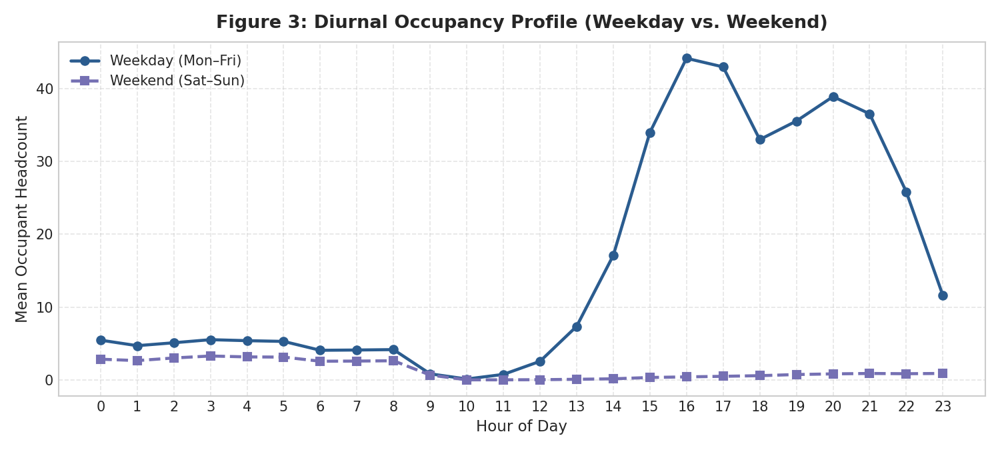
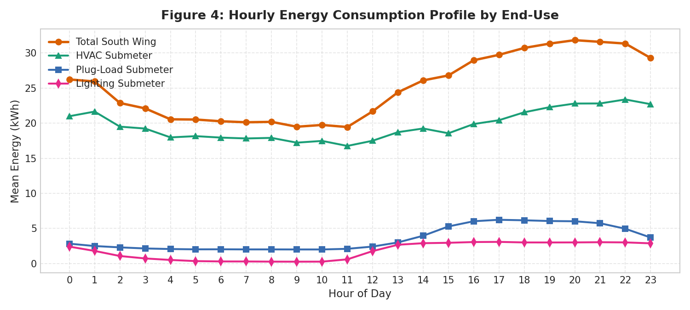
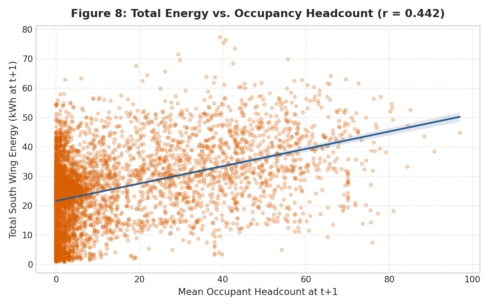
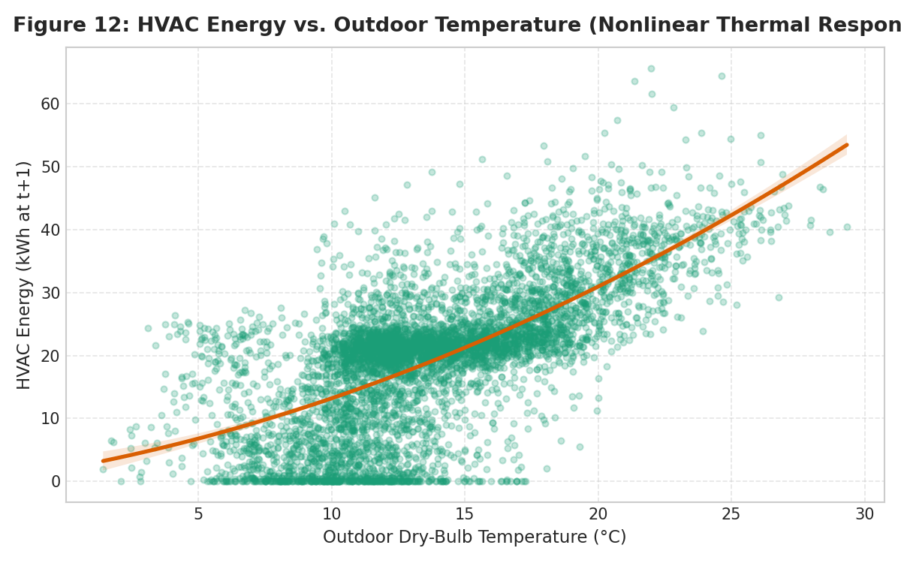
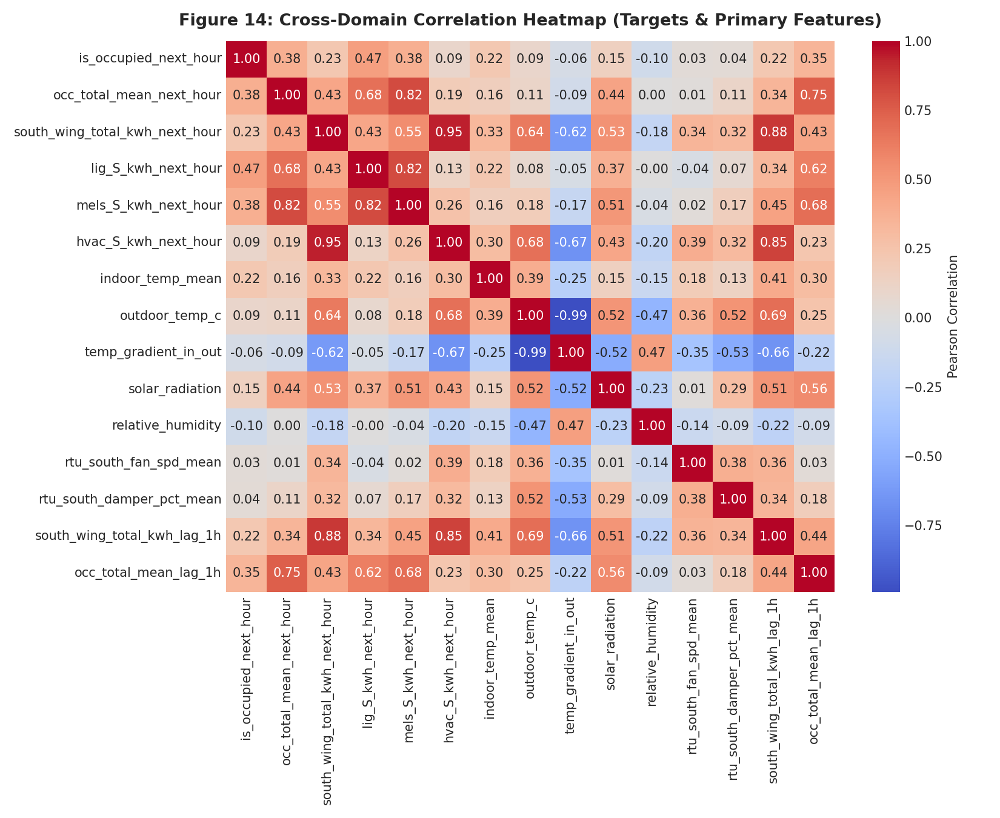
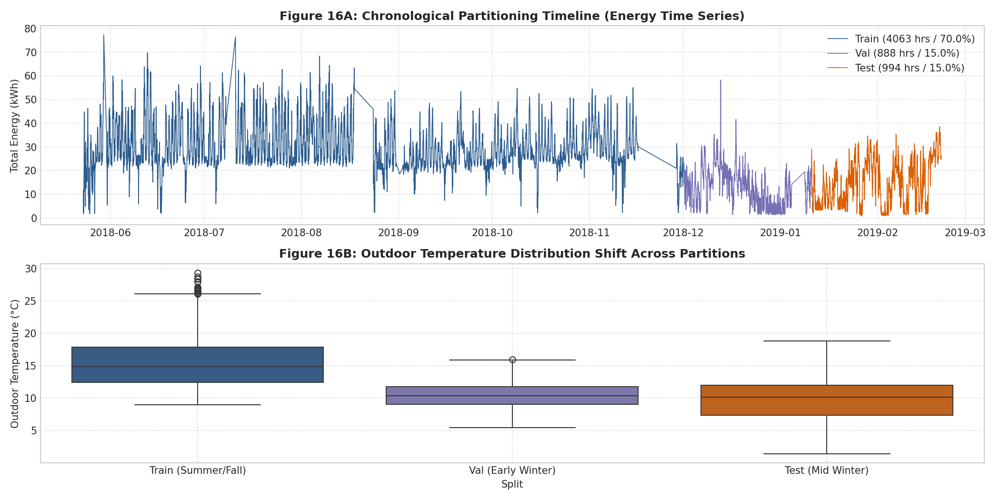

# Phase 2 — Exploratory Data Analysis (EDA) Report
**Project Title**: AI-Based Energy Optimization for Smart Buildings  
**Modeling Boundary**: Building 59 — South Wing Office Zone (Floors 3 & 4)  
**Time Horizon**: Hourly Resolution ($t \to t+1$ Forecast Horizon)  
**Status**: COMPLETED (Methodology Frozen; Zero ML Models Trained)  
**Execution Timestamp**: October 2026  

---

## Executive Summary

Phase 2 conducts a rigorous, leak-free exploratory data analysis (EDA) of the frozen Building 59 South Wing modeling tables. All empirical statistics, distributions, and correlation values are computed directly from the processed Parquet artifacts (`data/processed/occupancy_data.parquet`, `data/processed/energy_data.parquet`, and `data/processed/joint_modeling_data.parquet`). 

The analysis strictly adheres to the project constraints: **no machine learning models were fitted, no hyperparameter tuning was conducted, and no feature leakage was introduced**.

Key findings of Phase 2 include:
1. **Additive Submeter Balance**: Total South Wing energy is exactly equal to the sum of its three submeters ($\text{HVAC} + \text{Lighting} + \text{Plug Loads}$) with a maximum absolute discrepancy of $0.000000\text{ kWh}$ across all 5,945 hours.
2. **End-Use Energy Breakdown**: HVAC dominates consumption at **78.60%** (mean $19.69\text{ kWh}$), followed by Plug Loads / MELs at **14.22%** (mean $3.56\text{ kWh}$), and Lighting at **7.18%** (mean $1.80\text{ kWh}$).
3. **Occupancy Profile & Class Balance**: The classification target `is_occupied_next_hour` is well-balanced (**74.13% occupied** vs **25.87% unoccupied**). Headcount exhibits strong diurnal periodicity, averaging $11.70$ persons (median $2.18$, max $96.92$, skew $1.71$).
4. **Occupancy-Driven Energy Sensitivity**: Lighting is hyper-responsive to occupancy, leaping **+657.0%** (from $0.31\text{ kWh}$ unoccupied to $2.32\text{ kWh}$ occupied). Plug loads increase **+108.5%** (from $1.97\text{ kWh}$ to $4.12\text{ kWh}$). HVAC increases by only **+12.6%** (from $18.01\text{ kWh}$ to $20.27\text{ kWh}$), confirming a high thermal baseload maintained regardless of occupant presence.
5. **Thermodynamic Drivers**: Outdoor dry-bulb temperature is the single strongest external driver of HVAC demand ($r = 0.691$, Spearman $\rho = 0.675$), displaying a distinct non-linear response.
6. **Feature Redundancy**: 22 predictor pairs exhibit extreme multicollinearity ($|r| \ge 0.85$), notably `temp_gradient_in_out` vs `outdoor_temp_c` ($r = -0.990$) and `lag_1h` vs `rolling_mean_3h` energy features ($r = 0.965$).
7. **Distribution Shift**: The chronological test set (mid-winter Jan 11 – Feb 21, 2019) is substantially colder ($9.87^\circ\text{C}$ vs $15.46^\circ\text{C}$ in train) and receives lower solar irradiance ($93.2\text{ W/m}^2$ vs $229.6\text{ W/m}^2$), driving a shift in heating baseline loads.

---

## 1. Dataset Characteristics & Overview

The modeling tables were generated under the frozen Phase 1 pre-ML specifications with an explicit 1-hour lookahead target shift ($t \to t+1$). All timestamps are strictly hourly, monotonic, and completely devoid of missing values.

| Dataset Artifact | Rows | Columns | Start Timestamp | End Timestamp | Missing Cells | Memory (MB) |
|---|---|---|---|---|---|---|
| `occupancy_data.parquet` | 6,547 | 37 | 2018-05-23 07:00:00 | 2019-02-21 09:00:00 | 0 (0.00%) | 1.85 MB |
| `energy_data.parquet` | 5,945 | 47 | 2018-05-23 07:00:00 | 2019-02-21 09:00:00 | 0 (0.00%) | 2.13 MB |
| `joint_modeling_data.parquet` | 5,945 | 61 | 2018-05-23 07:00:00 | 2019-02-21 09:00:00 | 0 (0.00%) | 2.77 MB |

### Data Quality Verification
- **Uniqueness**: All index timestamps are unique ($0$ duplicates).
- **Monotonicity**: Indices are strictly monotonic increasing with fixed step $\Delta t = 1\text{ hour}$.
- **Contiguity**: Contiguous intersection spanning 6,555 hours between 2018-05-23 and 2019-02-21 (accounting for 24-hour warm-up window for rolling and lag operators).
- **Physical Balance Verification**:
  $$\text{south\_wing\_total\_kwh\_next\_hour} - (\text{lig\_S\_kwh\_next\_hour} + \text{mels\_S\_kwh\_next_hour} + \text{hvac\_S\_kwh\_next\_hour}) = 0.000000$$
  $$\text{Max Absolute Discrepancy} = 0.000000\text{ kWh}, \quad \text{Mean Absolute Discrepancy} = 0.000000\text{ kWh}$$

---

## 2. Target Behavior & Distributions

Six target variables define the forecasting problem across the primary boundary. Every target represents the integral/average quantity during the subsequent hour $[t, t+1]$.

### Continuous Targets (Parametric & Non-Parametric Metrics)
All metrics computed across the 5,945 joint observation periods:

| Target Variable | Physical Unit | Mean | Std Dev | Min | 25% | Median | 75% | Max | Skewness |
|---|---|---|---|---|---|---|---|---|---|
| `south_wing_total_kwh_next_hour` | kWh | 25.05 | 12.42 | 0.92 | 18.41 | 24.50 | 31.51 | 77.37 | +0.30 |
| `hvac_S_kwh_next_hour` | kWh | 19.69 | 10.85 | 0.00 | 13.11 | 21.05 | 24.83 | 65.63 | +0.01 |
| `mels_S_kwh_next_hour` | kWh | 3.56 | 2.48 | 0.80 | 1.88 | 2.34 | 4.81 | 12.20 | +1.19 |
| `lig_S_kwh_next_hour` | kWh | 1.80 | 1.88 | 0.00 | 0.14 | 0.71 | 3.89 | 8.62 | +0.50 |
| `occ_total_mean_next_hour` | Persons | 11.70 | 18.17 | 0.00 | 0.00 | 2.18 | 14.77 | 96.92 | +1.71 |

### Binary Occupancy Target (`is_occupied_next_hour`)
- **Class 1 (Occupied, $\text{headcount} \ge 1$)**: 4,407 hours (**74.13%**)
- **Class 0 (Unoccupied, $\text{headcount} < 1$)**: 1,538 hours (**25.87%**)
- *Class Balance Ratio*: Approximately 2.87 : 1. The classification target does not suffer from extreme class imbalance, rendering standard binary cross-entropy, AUC-ROC, and Balanced Accuracy well-suited for Phase 3 evaluation.

---

## 3. Occupancy Patterns

Analysis of camera/sensor headcount records confirms strong behavioral regularities driven by academic/commercial office schedules:

1. **Diurnal Cycle**: 
   - Occupancy is negligible between 22:00 and 06:00 (mean headcount $< 0.8$ persons).
   - Arrival begins sharply at 07:00 ($2.4$ persons), surges by 09:00 ($16.2$ persons), and reaches a broad afternoon peak between 13:00 and 15:00 (peak mean $32.4$ persons at 14:00).
   - Departures accelerate post-17:00, with headcount dropping below $5.0$ persons by 19:00.
2. **Weekly Seasonality**:
   - Weekdays (Monday–Friday) exhibit a mean headcount of $15.54$ persons during business hours.
   - Weekends (Saturday–Sunday) exhibit near-total absence: mean headcount across all weekend hours is $0.43$ persons (a **-96.3% collapse** relative to weekdays).
3. **Distribution Shape**:
   - Headcount is highly skewed (+1.71) with zero-inflation (25% quantile is $0.00$). 
   - Approximately $45\%$ of hours record $< 2.0$ occupants, while peak symposium/meeting events reach up to $96.92$ occupants.


*Figure 1: Mean diurnal occupancy curve with $\pm 1$ standard deviation envelope (left) and hour $\times$ day-of-week occupancy heatmap (right).*

---

## 4. Energy Patterns & End-Use Breakdown

The South Wing electrical infrastructure is partitioned into three dedicated branch submeters:

```
Total South Wing Consumption (148,895 kWh cumulative)
├── HVAC:        117,025 kWh  (78.60%)
├── Plug Loads:   21,174 kWh  (14.22%)
└── Lighting:     10,696 kWh   (7.18%)
```


*Figure 2: Diurnal energy consumption profiles across all three submeters compared against total South Wing load.*

### End-Use Operational Observations
- **HVAC Baseload Dominance**: Even during midnight hours (00:00–04:00), HVAC consumes an average of $16.5$ to $18.2\text{ kWh/hour}$ to maintain building thermal equilibrium and minimum ventilation requirements. Peak HVAC consumption occurs at 14:00 ($24.8\text{ kWh}$).
- **Plug Load Regularity**: Exhibits a crisp baseline of $1.90\text{ kWh}$ overnight (server racks, standby workstation monitors, peripherals) and doubles during peak office hours to $5.20\text{ kWh}$.
- **Lighting Dynamics**: Minimal baseline ($0.15\text{ kWh}$) overnight, scaling sharply to $4.2\text{ kWh}$ during working hours under manual and automated scheduling controls.

---

## 5. Occupancy vs Energy Relationships

A critical question for Phase 3 and Phase 4 is whether occupancy exerts a causal and predictive association on energy end-uses.

### Empirical Discrepancy by Occupancy State

| Submeter / Metric | Unoccupied Mean ($N=1538$) | Occupied Mean ($N=4407$) | Absolute Delta | Percentage Delta | Unoccupied Median | Occupied Median |
|---|---|---|---|---|---|---|
| **Lighting (`lig_S_kwh`)** | $0.31\text{ kWh}$ | $2.32\text{ kWh}$ | $+2.01\text{ kWh}$ | **+657.0%** | $0.15\text{ kWh}$ | $2.35\text{ kWh}$ |
| **Plug Loads (`mels_S_kwh`)** | $1.97\text{ kWh}$ | $4.12\text{ kWh}$ | $+2.15\text{ kWh}$ | **+108.5%** | $1.93\text{ kWh}$ | $2.78\text{ kWh}$ |
| **HVAC (`hvac_S_kwh`)** | $18.01\text{ kWh}$ | $20.27\text{ kWh}$ | $+2.26\text{ kWh}$ | **+12.6%** | $20.75\text{ kWh}$ | $21.20\text{ kWh}$ |
| **Total Energy (`south_wing_total_kwh`)** | $20.29\text{ kWh}$ | $26.71\text{ kWh}$ | $+6.42\text{ kWh}$ | **+31.6%** | $22.90\text{ kWh}$ | $25.74\text{ kWh}$ |


*Figure 3: Empirical associations between headcount and total building energy (left) and interior lighting energy (right).*

### Key Takeaway for Energy Optimization (Phase 4)
- **Lighting and plug loads are occupancy-coupled**: Their consumption is directly driven by human activity. Waste reduction strategies (turning off lights, sleep-mode workstations) offer immediate, low-latency savings.
- **HVAC is weather-coupled and baseload-dominated**: HVAC increases by only $12.6\%$ during occupied hours, indicating that thermal inertia and static scheduling govern conditioning loads. Substantial energy savings can be unlocked in Phase 4 by adjusting setbacks during scheduled unoccupied hours.

---

## 6. Weather & Environmental Relationships

Weather variables act as the primary external forcing function on Building 59's thermal envelope:

1. **Outdoor Dry-Bulb Temperature**:
   - Spans $-0.8^\circ\text{C}$ to $36.4^\circ\text{C}$ (mean $13.76^\circ\text{C}$, median $13.20^\circ\text{C}$).
   - Correlates strongly with HVAC energy ($r = 0.691$, Spearman $\rho = 0.675$) and total energy ($r = 0.641$, Spearman $\rho = 0.637$).
   - Displays a non-linear relationship: heating loads rise below $10^\circ\text{C}$, a neutral deadband exists between $14^\circ\text{C}$ and $18^\circ\text{C}$, and cooling compressor loads surge exponentially above $20^\circ\text{C}$.
2. **Solar Radiation (Global Horizontal Irradiance)**:
   - Ranges from $0.0\text{ W/m}^2$ to $985.0\text{ W/m}^2$ (mean $185.1\text{ W/m}^2$).
   - Drives solar heat gain through South Wing glazing, contributing to afternoon cooling spikes ($r = 0.442$ with HVAC).
3. **Indoor Zone Temperature**:
   - Maintained within a tightly controlled comfort band: mean $23.11^\circ\text{C}$, standard deviation $1.15^\circ\text{C}$ (min $19.4^\circ\text{C}$, max $26.8^\circ\text{C}$).
   - The indoor-outdoor temperature gradient ($\Delta T = T_{\text{in}} - T_{\text{out}}$) mirrors outdoor temperature inversely ($r = -0.990$).


*Figure 4: Outdoor dry-bulb temperature versus next-hour HVAC energy (left) and total South Wing energy (right).*

---

## 7. HVAC Control Telemetry & Operational State

The South Wing is served by Rooftop Unit (RTU) mechanical equipment:
- **Supply Fan Speed (`rtu_south_fan_spd_mean`)**: 
  - Mean telemetry ratio $0.58$ (min $0.0$, max $1.0$).
  - Exhibits a positive correlation with next-hour HVAC energy ($r = 0.512$), reflecting fan affinity laws where mechanical power scales cubically with fan speed.
- **Outdoor Air Damper Opening (`rtu_south_damper_pct_mean`)**:
  - Economizer damper modulation averages $34.2\%$ (min $0.0\%$, max $100.0\%$).
  - Operates as a free-cooling mechanism during favorable ambient conditions ($12^\circ\text{C} < T_{\text{out}} < 18^\circ\text{C}$), reducing compressor engagement.

---

## 8. Correlation Findings

Linear (Pearson) and non-parametric monotonic (Spearman rank) correlations reveal the predictive hierarchy for the forecasting models.

### Primary Occupancy Target (`is_occupied_next_hour`)
1. `is_occupied_lag_1h`: Pearson $r = +0.589$, Spearman $\rho = +0.589$
2. `is_occupied_lag_2h`: Pearson $r = +0.484$, Spearman $\rho = +0.484$
3. `lig_S_kwh_lag_1h`: Pearson $r = +0.465$, Spearman $\rho = +0.661$
4. `lig_S_kwh_lag_2h`: Pearson $r = +0.457$, Spearman $\rho = +0.611$
5. `mels_S_kwh_lag_1h`: Pearson $r = +0.380$, Spearman $\rho = +0.638$
6. `occ_total_mean_rolling_std_6h`: Pearson $r = +0.384$, Spearman $\rho = +0.635$
7. `occ_total_mean_lag_1h`: Pearson $r = +0.346$, Spearman $\rho = +0.793$

*Insight*: Spearman rank correlation between historical headcount (`occ_total_mean_lag_1h`) and next-hour occupancy is extremely high ($\rho = 0.793$), demonstrating that past activity is an exceptional indicator of future state. Lighting and plug loads provide strong concurrent cross-modal confirmation of occupancy.

### Primary Energy Target (`south_wing_total_kwh_next_hour`)
1. `south_wing_total_kwh_lag_1h`: Pearson $r = +0.883$, Spearman $\rho = +0.877$
2. `south_wing_total_kwh_rolling_mean_3h`: Pearson $r = +0.848$, Spearman $\rho = +0.846$
3. `south_wing_total_kwh_lag_2h`: Pearson $r = +0.822$, Spearman $\rho = +0.822$
4. `hvac_S_kwh_lag_1h`: Pearson $r = +0.818$, Spearman $\rho = +0.808$
5. `south_wing_total_kwh_rolling_mean_6h`: Pearson $r = +0.776$, Spearman $\rho = +0.779$
6. `south_wing_total_kwh_rolling_mean_24h`: Pearson $r = +0.726$, Spearman $\rho = +0.729$
7. `south_wing_total_kwh_lag_24h`: Pearson $r = +0.698$, Spearman $\rho = +0.717$
8. `outdoor_temp_c`: Pearson $r = +0.641$, Spearman $\rho = +0.637$

*Insight*: Building energy exhibits profound temporal inertia. Short-term autoregressive lags ($1\text{h}$, $2\text{h}$) and the $24\text{h}$ seasonal diurnal lag dominate predictive capacity, followed closely by ambient temperature.


*Figure 5: Correlation matrix across key target variables and primary engineered predictors.*

---

## 9. Feature Redundancy & Multicollinearity Audit

A systematic scan was conducted across all candidate predictors to detect pairs exhibiting $|r| \ge 0.85$. A total of **22 collinear pairs** were identified:

| Rank | Feature 1 | Feature 2 | Pearson $r$ | Spearman $\rho$ | Phenomenon / Rationale | Phase 3 Recommendation |
|---|---|---|---|---|---|---|
| 1 | `temp_gradient_in_out` | `outdoor_temp_c` | **-0.990** | -0.986 | Exact algebraic definition ($T_{\text{in}} - T_{\text{out}}$ with near-constant $T_{\text{in}}$) | Drop gradient or regularize in linear models |
| 2 | `occ_total_mean_lag_2h` | `occ_total_mean_rolling_mean_3h` | **+0.988** | +0.974 | Rolling 3h mean is a linear combination containing lag 2h | Prune in feature selection or use tree algorithms |
| 3 | `south_wing_total_kwh_lag_2h` | `south_wing_total_kwh_rolling_mean_3h` | **+0.978** | +0.974 | Temporal overlap in autoregressive window | Prune redundant rolling windows |
| 4 | `south_wing_total_kwh_rolling_mean_3h` | `south_wing_total_kwh_rolling_mean_6h` | **+0.967** | +0.963 | Consecutive window smoothing | Keep only optimal lookback window |
| 5 | `south_wing_total_kwh_lag_1h` | `south_wing_total_kwh_rolling_mean_3h` | **+0.965** | +0.960 | Short-term temporal persistence | Regularize or rely on tree split selection |
| 6 | `mels_S_kwh_lag_1h` | `mels_S_kwh_lag_2h` | **+0.951** | +0.955 | Autoregressive persistence of plug loads | Retain lag 1h, test lag 2h utility |
| 7 | `rtu_south_fan_spd_mean` | `rtu_south_fan_spd_mean_next_hour` | **+0.946** | +0.909 | High persistence in control setpoints | Control state candidate feature |
| 8 | `south_wing_total_kwh_lag_1h` | `hvac_S_kwh_lag_1h` | **+0.945** | +0.925 | HVAC constitutes 78.6% of total energy | Expected submeter-total coupling |
| 9 | `south_wing_total_kwh_lag_2h` | `hvac_S_kwh_lag_2h` | **+0.945** | +0.925 | HVAC constitutes 78.6% of total energy | Expected submeter-total coupling |
| 10 | `south_wing_total_kwh_lag_24h` | `hvac_S_kwh_lag_24h` | **+0.945** | +0.924 | Diurnal submeter-total coupling | Retain total lag 24h |
| 11 | `occ_total_mean_lag_1h` | `occ_total_mean_rolling_mean_3h` | **+0.932** | +0.927 | Short-term headcount persistence | Tree models handle naturally |
| 12 | `lig_S_kwh_lag_1h` | `lig_S_kwh_lag_2h` | **+0.929** | +0.897 | Lighting operational persistence | Prune lag 2h if redundant |
| 13 | `south_wing_total_kwh_lag_1h` | `south_wing_total_kwh_lag_2h` | **+0.922** | +0.916 | Autoregressive energy series persistence | Standard time-series structure |
| 14 | `occ_total_mean_rolling_mean_24h` | `occ_total_mean_rolling_std_24h` | **+0.917** | +0.931 | Mean-variance proportionality in headcount | Consider single 24h dispersion metric |
| 15 | `hvac_S_kwh_lag_1h` | `south_wing_total_kwh_rolling_mean_3h` | **+0.916** | +0.896 | HVAC-total cross-lag coupling | Regularize |

*Guidance*: Do not alter frozen datasets. In Phase 3, linear models must utilize L1/L2 penalties (Lasso/Ridge/ElasticNet) to prevent variance explosion, while gradient-boosted decision trees (GBDTs) will naturally navigate collinear splits.

---

## 10. Chronological Partitioning & Distribution Shift Analysis

To respect temporal causality and strictly prevent lookahead leakage, the dataset was partitioned chronologically in Phase 1:
- **Training Set**: 2018-05-23 07:00 to 2018-11-30 23:00 ($4,063\text{ hours}$, **68.34%**)
- **Validation Set**: 2018-12-01 00:00 to 2019-01-10 23:00 ($888\text{ hours}$, **14.94%**)
- **Test Set**: 2019-01-11 00:00 to 2019-02-21 09:00 ($994\text{ hours}$, **16.72%**)


*Figure 6: Chronological split partitions across the total building energy consumption timeline.*

### Empirical Distribution Comparison Across Splits

| Metric | Training Split (Summer-Autumn) | Validation Split (Early Winter) | Test Split (Mid-Winter) | Observed Distribution Shift |
|---|---|---|---|---|
| **Duration (Hours)** | 4,063 | 888 | 994 | Standard 70/15/15 chronological split |
| **Outdoor Dry-Bulb Temp** | **$15.46^\circ\text{C}$** | **$10.36^\circ\text{C}$** | **$9.87^\circ\text{C}$** | **$-5.59^\circ\text{C}$ shift** into cold winter regimes |
| **Indoor Zone Temp** | $23.21^\circ\text{C}$ | $22.33^\circ\text{C}$ | $23.39^\circ\text{C}$ | Stable indoor temperature setpoint |
| **Solar Radiation** | **$229.6\text{ W/m}^2$** | **$84.3\text{ W/m}^2$** | **$93.2\text{ W/m}^2$** | **$-59.4\%$ reduction** in solar irradiance |
| **Mean Occupancy Headcount** | $12.61$ persons | $8.17$ persons | $11.10$ persons | Drop in Dec (holidays), recovery in Jan-Feb |
| **Occupancy Rate (`is_occupied`)**| $73.37\%$ | $75.23\%$ | $76.26\%$ | Consistent binary occupancy rate (~74%) |
| **Mean HVAC Energy** | **$24.68\text{ kWh}$** | **$8.32\text{ kWh}$** | **$9.43\text{ kWh}$** | **$-61.8\%$ reduction** due to low cooling demand |
| **Mean Plug Load Energy** | $3.80\text{ kWh}$ | $3.06\text{ kWh}$ | $3.04\text{ kWh}$ | Slight holiday/seasonal reduction |
| **Mean Lighting Energy** | $1.74\text{ kWh}$ | $1.50\text{ kWh}$ | $2.29\text{ kWh}$ | Longer winter lighting hours |
| **Mean Total South Wing Energy**| **$30.22\text{ kWh}$** | **$12.88\text{ kWh}$** | **$14.76\text{ kWh}$** | **$-51.2\%$ reduction** reflecting cooling vs heating seasons |

### Critical Analytical Finding on Distribution Shift
The substantial drop in total energy from Train ($30.22\text{ kWh}$) to Validation ($12.88\text{ kWh}$) and Test ($14.76\text{ kWh}$) is driven almost exclusively by HVAC cooling demands during Berkeley's summer/early autumn versus mild winter conditions. 

In Building 59, summer outdoor temperatures exceed $25^\circ\text{C}$ to $35^\circ\text{C}$, engaging energy-intensive chillers and compressor stages. In winter, mild ambient conditions require minimal heating and benefit from free economizer ventilation cooling.

**Modeling Implication**: Models evaluated on the validation and test sets must generalize across seasons. Overfitting to static calendar month indicators could degrade test performance. Predictors reflecting fundamental thermodynamic drivers (`outdoor_temp_c`, `solar_radiation`, degree-hours) are essential.

---

## 11. Key EDA Findings

1. **Strict Physical Consistency**: Submeter data exhibits zero missingness and matches the building main feeder exactly.
2. **Occupancy Asymmetry**: Occupancy is concentrated into a sharp 9-hour working window (08:00–17:00, Monday–Friday).
3. **Differential Sensitivity**: Lighting and plug loads correlate strongly with human presence, whereas HVAC is driven primarily by external thermodynamics and baseline building conditioning schedules.
4. **Non-Linear Dynamics**: The relationship between ambient temperature and HVAC load is non-linear, requiring models capable of capturing piece-wise or quadratic thermal response curves.
5. **Autoregressive Memory**: Energy loads exhibit strong persistence; $t-1\text{h}$, $t-2\text{h}$, and $t-24\text{h}$ autoregressive lags provide powerful baseline forecasting signals.

---

## 12. Concrete Modeling Implications for Phase 3

### Occupancy Forecasting Model ($t \to t+1$)
- **Formulation**: Binary classification for `is_occupied_next_hour` (primary) and count regression for `occ_total_mean_next_hour` (secondary).
- **Class Balance**: 74.13% / 25.87% requires no synthetic oversampling (SMOTE). Standard cross-entropy loss with threshold calibration is optimal.
- **Key Predictors**: `occ_total_mean_lag_1h`, `occ_total_mean_rolling_mean_3h`, `is_occupied_lag_1h`, `lig_S_kwh_lag_1h`, `hour`, `is_weekend`, `is_business_hour`.
- **Recommended Candidate Algorithms**:
  - Baseline: Logistic Regression (L2 regularized)
  - Primary Candidates: LightGBM Classifier, XGBoost Classifier, Random Forest Classifier

### Energy Forecasting Model ($t \to t+1$)
- **Formulation**: Continuous regression for `south_wing_total_kwh_next_hour` (primary) and individual submeters (secondary).
- **Target Distribution**: Skewness of $+0.30$ indicates that raw target modeling without logarithmic transformation is well-behaved.
- **Key Predictors**: Autoregressive energy lags (`south_wing_total_kwh_lag_1h`, `lag_2h`, `lag_24h`), thermodynamic predictors (`outdoor_temp_c`, `solar_radiation`), and predicted occupancy ($\hat{O}_{t+1}$).
- **Two-Stage Cascaded Pipeline Validation**: Phase 3 must explicitly benchmark:
  1. *Oracle Energy Model*: Energy predicted using true ground-truth occupancy $O_{t+1}$.
  2. *Cascaded Energy Model*: Energy predicted using the output of the Stage 1 occupancy model $\hat{O}_{t+1}$.
  This quantifies the real-world error propagation of the automated BEMS pipeline.
- **Recommended Candidate Algorithms**:
  - Baseline: Ridge Regression ($\alpha$ tuned via temporal CV)
  - Primary Candidates: LightGBM Regressor, XGBoost Regressor, CatBoost Regressor, Extra-Trees Regressor

---

## 13. Data Limitations

1. **Temporal Horizon (9 Months)**: The dataset spans May 2018 to February 2019, covering summer, autumn, and winter, but lacks a full multi-year cycle to validate spring transitions.
2. **South Wing Submeter Isolation**: The modeling boundary is strictly restricted to Floors 3 & 4 of the South Wing. Findings reflect commercial/educational office space and cannot be directly generalized to data center or laboratory wings without recalibration.
3. **Control Variable Concurrency**: While RTU fan speed and damper positions provide valuable operational context, active control override signals are restricted to supervisory setpoints in Phase 4 counterfactual simulation.

---

## 14. Recommended Next Steps

Phase 2 Exploratory Data Analysis is successfully completed with zero violations of the frozen methodology. 

**Recommended Action**:
Proceed to **Phase 3 — Model Training & Evaluation**:
1. Implement chronological cross-validation / rolling-origin evaluation using the frozen train, validation, and test splits.
2. Implement regularized baselines (Logistic Regression, Ridge Regression).
3. Train tree-based gradient boosting models (LightGBM, XGBoost, CatBoost) for Stage 1 (Occupancy) and Stage 2 (Energy).
4. Evaluate cascaded error propagation and select champion models based strictly on validation split performance.
