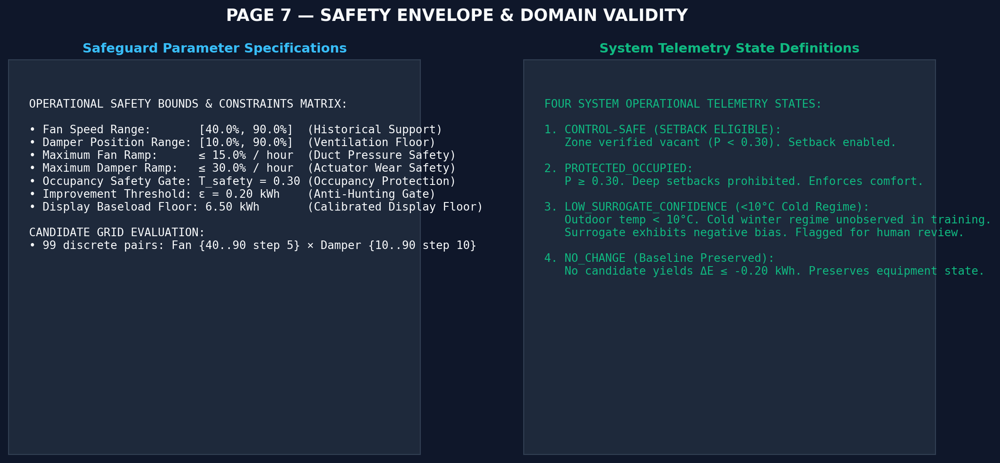
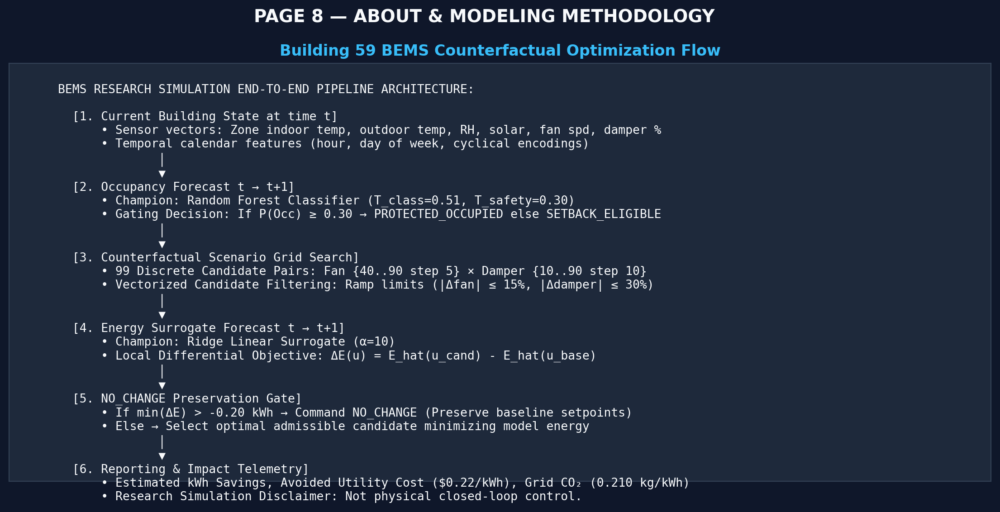

# Phase 5 — Interactive Streamlit BEMS Dashboard Documentation

**Project:** AI-Based Energy Optimization for Smart Buildings  
**Target:** Lawrence Berkeley National Laboratory (LBNL) Building 59 (South Wing, Floors 3 & 4)  
**Deliverable:** `dashboard/app.py` & `dashboard/utils.py`  
**Phase Status:** COMPLETED  

---

## 1. Executive Summary & Framing

Phase 5 delivers an interactive, production-grade Building Energy Management System (BEMS) research simulation dashboard built with **Streamlit 1.60.0** and **Plotly 7.0.0**. 

```
     Current Building State (t)
               ↓
     Occupancy Forecast (t → t+1) [Random Forest, T_class=0.51, T_safety=0.30]
               ↓
     Energy Forecast (t → t+1) [Ridge Regression, α=10]
               ↓
     Counterfactual Optimization (Bounded Grid Search over 99 Candidates)
               ↓
     Recommended Operating Setpoints (Fan Speed %, Damper %)
               ↓
     Estimated Differential Savings (ΔE = E_cand - E_base)
```

### Academic Research Simulation Framing
All delta energy values and recommended operating setpoints are **model-based counterfactual estimates** derived from an empirical linear Ridge surrogate under bounded operating envelopes. They represent research simulation scenarios, **NOT** experimentally verified physical control or utility-measured savings. Throughout the application, metrics are explicitly labeled as *"Estimated"*, *"Model-predicted"*, *"Simulated"*, or *"Counterfactual"*.

---

## 2. Dashboard Architecture

The dashboard is structured into 8 cohesive analytical and operational views accessible via an intuitive sidebar navigation:

| View | Page Title | Core Purpose |
| :--- | :--- | :--- |
| **Page 1** | **Executive Overview** | Real-time instantaneous BEMS telemetry, high-level KPIs, status badges, and 10-day trajectory preview. |
| **Page 2** | **Live Scenario Simulator** | Interactive historical test-hour picker, what-if override sliders, real-time optimization trigger, and diagnostic setpoint attribution. |
| **Page 3** | **Energy Analytics** | Comprehensive tripartite comparison (Actual vs Baseline vs Counterfactual), delta time series, cumulative savings, and submeter breakdown. |
| **Page 4** | **Occupancy Analytics** | Occupancy probability trajectory, dual-threshold reference lines ($T_{\text{class}}=0.51$, $T_{\text{safety}}=0.30$), diurnal profiles, and weekly heatmaps. |
| **Page 5** | **ML Model Performance** | Benchmark registry comparing all 10 candidate architectures from Phase 3 and baseline models (persistence, seasonal naive). |
| **Page 6** | **Optimization Analysis** | Aggregate Phase 4 simulation metrics, regime breakdown (occupied vs vacant, cold vs mild), and safeguard ablation studies. |
| **Page 7** | **Safety & Validity** | Deterministic safety envelopes, ramp rate limits, the four system operational states, and domain extrapolation warnings. |
| **Page 8** | **About & Methodology** | System specifications, mathematical formulations, economic and emissions factors, and academic attribution. |

---

## 3. Data Sources & Model Integration

### Serialized Model Artifacts (Zero Retraining)
The dashboard strictly consumes pre-trained champion artifacts without retraining:
- **Occupancy Champion:** `models/occupancy/random_forest.joblib` + `models/occupancy/scaler.joblib`
  - $T_{\text{class}} = 0.51$ (classification threshold tuned for balanced F1)
  - $T_{\text{safety}} = 0.30$ (conservative safety threshold for HVAC setback gating)
- **Energy Surrogate Champion:** `models/energy/ridge.joblib` + `models/energy/scaler.joblib`
  - Ridge regression ($\alpha = 10$) with linear monotonic gradients across control candidates.

### Processed Modeling Data
- `data/processed/phase4_simulation_results.parquet`: Precomputed 994-hour test period simulation containing baseline display energy, optimized energy, deltas, tariffs, emissions, confidence flags, and submeters (`hvac_actual_kwh`, `lig_actual_kwh`, `mels_actual_kwh`).
- `data/processed/joint_modeling_data.parquet`: Cleaned 5,124-hour joint modeling table providing full observed sensor vectors for single-hour scenario lookups.
- `docs/phase3_results.json` & `docs/phase3_robustness_results.json`: Frozen validation and test metrics.
- `docs/phase4_results.json`: Phase 4 simulation aggregate KPIs and ablation study benchmarks.

---

## 4. Detailed Page Breakdown & Visual Documentation

### Page 1 — Executive Overview

- **KPI Cards:** Forecasted occupancy state and probability, outdoor temperature regime, baseline predicted energy, counterfactual predicted energy, estimated hourly savings, and avoided cost/carbon rates.
- **Status Badges:** Dynamic telemetry badge indicating `CONTROL-SAFE`, `PROTECTED_OCCUPIED`, `LOW_SURROGATE_CONFIDENCE`, or `NO_CHANGE`.
- **Trajectory Preview:** Plotly tripartite line chart displaying actual total energy, baseline display prediction, and counterfactual optimized prediction across test hours.

### Page 2 — Live Scenario Simulator

- **Historical Timestamp Picker:** Curated preset dropdown (Cold Winter Night, Peak Business Hours, Morning Transition, Weekend Daytime Setback, etc.) or full test-period slider.
- **Observed Sensor Vector:** Real indoor temp ($T_{\text{in}}$), outdoor temp ($T_{\text{out}}$), relative humidity, solar radiation, baseline fan speed, and damper position.
- **Counterfactual Overrides Expander:** Sliders enabling what-if perturbations while respecting hard physical bounds.
- **Action Trigger:** `OPTIMIZE BUILDING CONTROLS` button running single-hour candidate evaluation in $<1\text{ ms}$.
- **Attribution Engine:** Clear natural-language rationale explaining why an action was taken (e.g., *"reduce mechanical fan load"*, *"maintain occupied safety"*, *"ramp-rate restriction"*).

### Page 3 — Energy Analytics

- **Interactive Filters:** Date range selector, occupancy state (All, Occupied, Unoccupied), and temperature regime (Cold $<10^\circ\text{C}$, Mild $10\text{--}16^\circ\text{C}$, Warm $>16^\circ\text{C}$).
- **7 Coordinated Charts:**
  1. Tripartite time series trajectory.
  2. Actual vs Baseline Model correlation and parity line.
  3. Actual vs Counterfactual correlation.
  4. Hourly estimated $\Delta E$ bar chart with zero-line.
  5. Cumulative estimated energy savings trajectory.
  6. Hourly savings distribution histogram.
  7. South Wing submeter pie chart breakdown (HVAC vs Lighting vs Plug Loads).

### Page 4 — Occupancy Analytics

- **Probability Trajectory:** Hourly predicted probability $P(\text{Occ}=1)$ plotted against ground truth with dual reference lines ($T_{\text{class}}=0.51$ and $T_{\text{safety}}=0.30$).
- **Diurnal Profiles:** Weekday vs Weekend mean occupancy curves demonstrating distinct occupancy schedules.
- **Weekly Heatmap:** Day of Week $\times$ Hour of Day occupancy density.
- **Test Metrics Registry:** Precision ($0.9332$), Recall ($0.9508$), F1-score ($0.9419$), ROC-AUC ($0.9392$), PR-AUC ($0.9806$), Balanced Accuracy ($0.8643$).
- **Dual-Threshold Architecture Callout:** Explaining the asymmetric operational risk mitigation achieved by $T_{\text{safety}}=0.30$.

### Page 5 — ML Model Performance

- **Occupancy Classifier Benchmark:** Comparison table and bar chart across Logistic Regression, Decision Tree, Random Forest, XGBoost, and LightGBM.
- **Energy Surrogate Benchmark:** Validation RMSE and $R^2$ across Ridge, Random Forest, Extra Trees, XGBoost, and LightGBM.
- **Naive Baseline Audit:** Comparison against persistence ($R^2=0.77$) and seasonal naive ($R^2=-0.07$).
- **Selection Rationale:** Explanation of why Ridge Regression was chosen over tree ensembles due to monotonicity and absence of step-function artifacts under counterfactual perturbations.

### Page 6 — Optimization Analysis

- **Aggregate KPIs:** 994 evaluated hours, 804 optimized hours ($80.89\%$), 190 NO_CHANGE hours ($19.11\%$), $5,120.45\text{ kWh}$ cumulative savings ($53.32\%$ reduction relative to baseline display floor), $\$1,126.50$ cost savings, $1,075.29\text{ kg CO}_2$ reduction.
- **Regime Stratification:** Comparative charts breaking down savings by occupancy regime and temperature regime.
- **Safeguard Ablation Study:** Table and chart comparing No Safety Gate, With Safety Gate, No Ramp Protection, and Full Safeguards.
- **Non-Physical Ramp Alert:** Clear callout highlighting that removing ramp constraints produces an impossible $115.86\%$ saving ($11,125.39\text{ kWh}$), proving the necessity of ramp limits.

### Page 7 — Safety & Validity

- **Operational Envelopes:**
  - Supply Fan Speed: $[40.0\%, 90.0\%]$
  - Outdoor Damper Position: $[10.0\%, 90.0\%]$
  - Supply Fan Ramp: $\le 15.0\%/\text{hr}$
  - Damper Ramp: $\le 30.0\%/\text{hr}$
  - Display Baseload Floor: $6.50\text{ kWh}$
  - Improvement Deadband: $\epsilon = 0.20\text{ kWh}$
- **Four Operational States:**
  1. `CONTROL-SAFE (SETBACK ELIGIBLE)` ($P < 0.30$)
  2. `PROTECTED_OCCUPIED` ($P \ge 0.30$)
  3. `LOW_SURROGATE_CONFIDENCE` ($T_{\text{out}} < 10^\circ\text{C}$)
  4. `NO_CHANGE` (improvement $< \epsilon$)
- **Domain Limitations:** Modeling boundaries regarding empirical surrogates vs physics engines, lack of zone thermal capacitance modeling, and offline simulation scope.

### Page 8 — About & Methodology

- **Pipeline Architecture:** ASCII workflow detailing feature flows.
- **Technical Specifications:** Scope, sensor resolution, prediction horizon, candidate grid (99 discrete pairs), electricity tariff ($\$0.22/\text{kWh}$), and carbon intensity ($0.210\text{ kg CO}_2/\text{kWh}$).
- **Mathematical Equations:** Local differential formulation $\Delta E(u) = \hat{E}(u_{\text{candidate}}) - \hat{E}(u_{\text{baseline}})$.
- **Attribution & Source:** Reference to LBNL Building 59 dataset.

---

## 5. Running the Application

### Launch Command
To launch the interactive dashboard locally:

```powershell
streamlit run dashboard/app.py
```

The application automatically opens at `http://localhost:8501`.

### Performance Optimizations
- **Data Caching:** Simulation tables and joint datasets are cached in memory using `@st.cache_data`. Initial startup takes $<1.5\text{ s}$, and subsequent page transitions are instantaneous.
- **Model Caching:** Model joblibs are loaded once via `@st.cache_resource`.
- **Vectorized Evaluation:** Single-hour scenario optimization executes in $<1\text{ ms}$ using vectorized candidate matrix multiplication.

---

## 6. Automated Test Suite Integration

The dashboard utility module and optimization interfaces are covered by automated unit and integration tests in `tests/test_dashboard.py`:

```powershell
pytest -v tests/test_dashboard.py
```

### Verified Test Cases:
1. `test_dashboard_app_imports_cleanly`: Confirms `dashboard.app` and `dashboard.utils` import without error.
2. `test_required_data_and_metric_files_exist`: Verifies all parquet and json files exist.
3. `test_serialized_models_load_successfully`: Validates champion RF and Ridge model schemas.
4. `test_simulation_data_schema_and_integrity`: Confirms 994 rows and all 26 feature columns.
5. `test_representative_scenarios_exist_and_execute`: Validates that curated scenario timestamps execute cleanly and never increase energy.
6. `test_scenario_optimization_output_schema`: Asserts output dictionary schema matches required contract.
7. `test_scenario_overrides_functionality`: Tests what-if parameter perturbations.
8. `test_graceful_error_handling_on_invalid_timestamp`: Ensures invalid queries raise handled exceptions cleanly.
9. `test_safety_gate_occupancy_protection`: Proves $T_{\text{safety}}=0.30$ triggers `PROTECTED_OCCUPIED` across all qualifying hours.

The entire project test suite passes **41/41 tests in 5.1s**.
